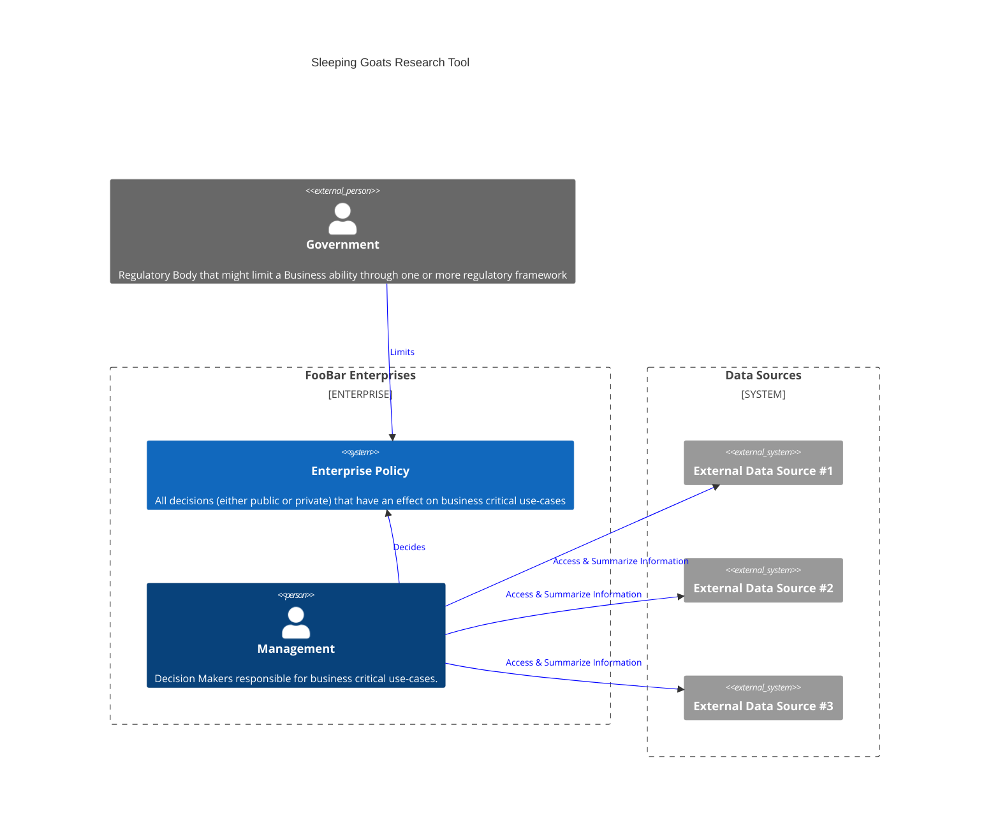

# Sleepy Goats

A Junction 2023 Hackathon project.

  

Sleeping Goat is a sustainable AI assistant designed for dynamic information retrieval and summarization, catering to crucial business needs.

We leverage the Electricity Maps API to schedule data scraping during low-emission periods, ensuring our operations are as green as possible.

Users have control over the data sources, which range from news aggregators to patent databases. Our curated packs guarantee reliability, avoiding hallucinations and misinformation.

## Architectural Overview

Our AI prioritizes trustworthiness and efficiency. By pre-processing and indexing internet data, we minimize energy consumption and carbon footprint, unlike conventional real-time processing.

With RAG, or resource-augmented generation, the AI's context is pre-evaluated from trusted sources, supplemented by daily updates and real-time scraping options for the latest information.

Sleepy Goat provides a general Framework for interactions.
For documentation purposes a dummy Enterprise "FooBar Enterprises" will be used to represent
any Entity that uses this particular Software.

In a traditional company sense decisions are managed by the following paradigm:

Using our tool the Workflow changes

