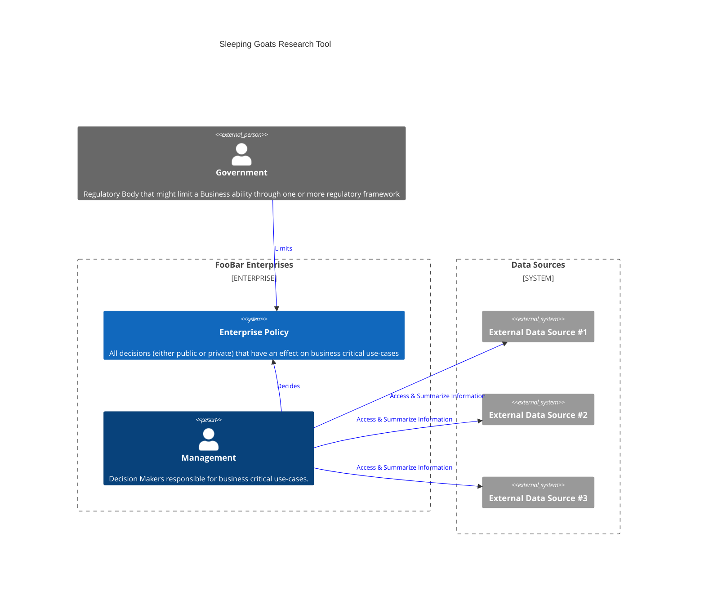

# Sleepy Goats

Sleepy Goats provides a general Framework for interactions.
For documentation purposes a dummy Enterprise "FooBar Enterprises" will be used to represent
any Entity that uses this particular Software.

In a traditional company sense decisions are managed by the following paradigm:

Using our tool the Workflow changes

